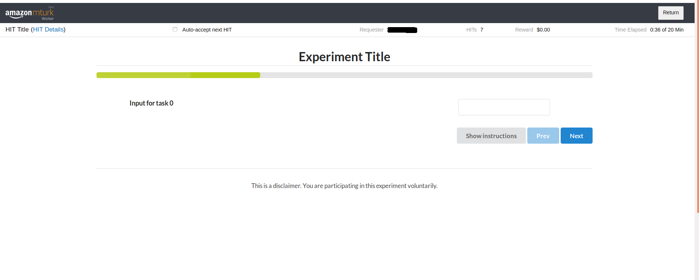
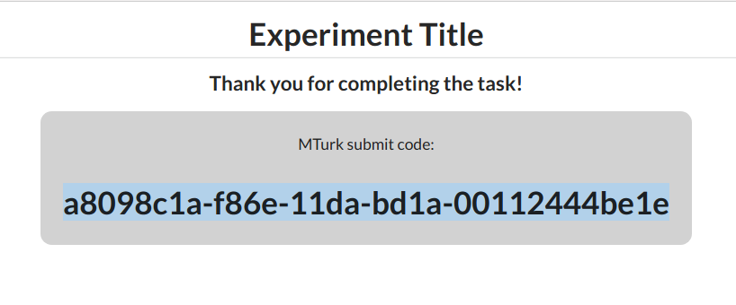

# Generalized MTurk Task Template
A general-purpose template for Amazon Mechanical Turk tasks.

### Development
Run something like `python3 -m http.server` to test out the UI locally.

Jupyter notebooks in the `mturk` folder are provided for launching and monitoring HITs. Edit the `hitCreation` fields in `config.json` to define how to set up your HITs.

### UI Customization
This framework can be used to create MTurk HITs, broken up into discrete repeated subtasks.

To define your MTurk HIT, you only need to change things in three places: `index.js`, `custom.js`, and `config.json`. 

#### `index.html`
Find the section marked `<!-- vv CUSTOM EXPERIMENT MARKUP GOES HERE vv -->`, and add your custom HTML elements in that section (e.g. image divs, input boxes). Add `id`s to those HTML elements so you can easily refer to them with JQuery in the page's JavaScript (see `assets/js/custom.js`).

#### `assets/js/custom.js`
Fill out the 4 functions: `loadTasks`, `showTask`, `collectData`, and `validateTask`. These define behavior for loading initial data, displaying a task, storing data from a task, and validating a task. We recommmend starting by copying one of our template files: `assets/js/aggregate-template.js` if you have set `config.meta.aggregate=true` or `assets/js/no-aggregate-template.js` if you have set `config.meta.aggregate=false`. 

#### `config.json`
Here, you can define your HIT's name, description, number of subtasks, instructions, etc. Keep reading for a detailed description of the fields in the config. 

##### Metadata

These fields are used to customize the UI template used for your task.

* `meta.title` - the title of your task, displayed in the page title (string)
* `meta.description` - a short overview of your task's purpose, displayed as bolded text right below the page title (string)
* `meta.numSubtasks` - the number of subtasks your task will have (int)
* `meta.disclaimer` - the experiment disclaimer text displayed at the bottom of the page (string)
* `meta.aggregate` - whether inputs and outputs for the task should be divided up by subtasks, or the same inputs and outputs should be stored across all subtasks. If false, outputs will be stored in an array of length `numSubtasks`; otherwise, they will be merged a single object. In general, setting this to `false` will be better if subtasks are repetitive and self-contained (for example, labeling a series of images), and this to `true` will be better if the behavior of one subtask depends on input/output from another subtask (for instance, labeling an image in one subtask and writing a description of it in the next). 

##### Instructions

These fields populate the instructions for your task. 

* `instructions.simple` - short instruction paragraph displayed below the task description. You can include HTML tags here! (string)
* `instructions.steps` - an array of instruction strings, displayed as a bulleted list on the page. You can include HTML tags here! (array of strings)
* `instructions.images` - an array of URLs for demo gifs on the instruction page. One of these will be displayed randomly on each page load. (array of strings)

##### Hit Creation

These fields are used by the scripts in the `mturk` folder to define how your HIT(s) will appear on MTurk.

* `hitCreation.title` - the HIT's title on the MTurk worker page (string)
* `hitCreation.description` - the HIT's description on the MTurk worker page (string)
* `hitCreation.rewardAmount` - amount to pay per HIT (string)
* `hitCreation.keywords` - comma-separated tags (string)
* `hitCreation.duration` - how long you want to give each worker to complete the task once started in seconds (int)
* `hitCreation.lifetime` - how long you want the HIT on the worker site in seconds (int)
* `hitCreation.taskUrl` - the URL where your MTurk task lives (string)
* `hitCreation.production` - whether you want to use MTurk's production or sandbox environment (bool)
* `hitCreation.numTasks` - how many duplicates of the HIT you want to create. Either this or `hitCreation.variants` must be specified. Overrides `hitCreation.variants`. (int)
* `hitCreation.variants` - a list of dictionaries, where each dictionary represents a variant of your HIT. For each variant, the keys of the variant are merged with the rest of the keys in the `hitCreation` section of the config to create a full config object, and one task is generated to that specification, for a total of len(variants) tasks. For instance, you could use this to create 5 HITs where each one has a different querystring. Either this or `hitCreation.numTasks` must be specified; overriden by `hitCreation.numTasks`.

##### Advanced

These are advanced fields and features that will further customize your task.

Config fields: 
* `advanced.hideIfNotAccepted`: will automatically hide your HIT and show an error message if the user is viewing in an MTurk iFrame and has not yet accepted the task. The same behavior can be invoked manually from `custom.js` by calling `hideIfNotAccepted()`. (bool)
* `advanced.includeDemographicSurvey` - setting this value to `true` automatically adds a demographic survey to the end of your task and collects/validates the data in it. 
* `advanced.externalSubmit`: configure the task as an external link that submits data to an external source, instead of an MTurk iframe that submits data to the MTurk back-end (see the next section for details). Requires that `advanced.externalSubmitUrl` be set. (bool)
* `advanced.externalSubmitUrl`: if `externalSubmit` is `true`, the url or the relative path of the route to poste the data to. It is expected that this route will accept the data via POST request and return an object containing a key `key` containing a validation code. (string)

Features: 
* use a queryword `skipto=<taskIndex>` to skip forward to the given `taskIndex`, for debugging purposes.

### MTurk HIT configuration 

This framework supports two different ways of configuring your hit. 

##### MTurk iframe

Set `config.advanced.externalSubmit` to `false`.

Your task will be displayed as an iframe within MTurk and your data will be submitted to MTurk's own back-end and stored there. You can download your collected data directly from MTurk.

##### External link

Set `config.advanced.externalSubmit` to `true`.

On MTurk, your task appears as a link to your external website (specified by `config.hitCreation.taskUrl`) along with an input box for a confirmation code. MTurk workers navigate to your website and complete your task there. When they hit submit, their data is POSTed to `config.advanced.externalSubmitUrl`. This API is respnsible for returning a json object with a key called `key`. This will be displayed to the MTurk worker and they will input that key into the text box on MTurk as proof that they completed the task. You can download these keys from MTurk and use them to confirm that work was completed/approve the HITs.

 

You are responsible for setting up your own data-collection infrastructure and issuing keys that you can use to confirm that workers completed the task.

### Screenshots
Here's a demo of the task interface:

