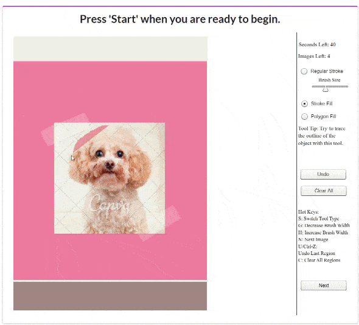

# ImportAnnots labeling tool

This is the repository for the ImportAnnots labeling tool. This tool can be used for multi-purpose content labeling on images. It has been primarily used for annotating importance on graphic designs (see O'Donovan et al., 2014 and Bylinskii et al., 2017).

Example of the interface running:



## What can it do?

The interface allows you to annotate a set of up to 24 images with 3 different highlighting tools:
1. Stroke Fill (default):
- (1) Click on the edge of the element you would like to trace around.
- (2) While holding the mouse down, trace around the element until you reach your approximate starting point.
- (3) A nice outline will be automatically created. If you are unsatisfied with it, you can click 'Undo'.

2. Polygon Fill:
- (1) Click on the Polygon Fill button on the right menu.
- (2) Click on the edge of the element you want to annotate.
- (3) Let go of the mouse and move it towards a new edge. A straight line between the starting point and your mouse position will be automatically created.
- (3) Click again to generate a new point.
- (4) Continue outlining the object until you reach your starting point, indicated by a blue circle. Clicking on the blue circle completes the annotation.

3. Regular Fill (Brush):
- (1) Click on the Regular Stroke button on the right menu.
- (2) Pick a Brush Size (or go with the default).
- (3) Paint over the whole image region you want to select as important.
If possible, try to avoid this method, as it produces noisy boundaries.

To test out the interface, you can simply go to https://turkeyes.github.io/importannots/?url=fold_main_posters_0.txt?assignmentId=%27%27, where a demo version is currently hosted.


## Running it locally
We have also configured this repository to work out of the box on a local server. To make it work locally (which could help to easily test new images), simply clone this repository, move to this repository's folder and start an http server:

```
cd importannots
python -m http.server
```

Go to localhost:YourPort (defined by the previous command), and you will be able to see the task. You won't be able to play, however, until you define what images you want to label. This is defined through a txt file located in files/ called fold. We have multiple available folds for testing purposes. To utilize it, you need to pass 2 key parameters through the URL: the fold name that you want to use, and a dummy workerId (this field is normally populated by MTurk). In short, if you want to access fold1.txt, you would go to the following URL: https://localhost:YourPort/?url=fold_main_posters_0.txt?assignmentId=''.

## How can I use this on my own data?
On the local side, loading new data is easy. The interface loads a set of images at every game defined by a txt file called fold. The fold is simply a set of links, one per line, to hosted images on the web. All folds must be located on the "files" folder of the project (examples can be seen there). To test the interface on a set of 10 new images, for example, one would build a txt file with 10 links of images on the web (one per line). Then, by accessing https://localhost:YourPort/?fold="yourfold.txt"?assignmentId='', The interface automatically parses the given fold and shows the 10 images requested.

If you plan to use this interface on Amazon Mechanical Turk, first set the flag `advanced.downloadDataOnSubmit` in `config.json` to false. Then, make sure to create a HIT as an iframe and link to a hosted version of this interface that you control (so that you can put new folds).

## Contents
1. Base folder: Contains base images, config files and impdraw7.swf, the core flash application.
2. assets: Contains required .css, .js and other dependencies.
3. files: Folder containing txt files corresponding to folds. For the interface to load a fold, say fold1 (using ?fold=fold1.txt on the url), that fold must be present in this folder.
4. img: Images shown in the instructional page of the task.
5. jsons: Contains json for the sentinel images. Only used if sentinels detected in your fold.

## Credits
This code is a combination of Kimberli Zhong's [MTurk template](https://github.com/kimberli/mturk-template) and Peter O'Donovan's [Importance annotation UI](http://www.cs.toronto.edu/~donovan/mturk/test/drawgdimp.shtml?url=input-gd_t1_3.txt&assignmentId=asdf). This code was packaged together into its current form by Camilo Fosco and Anelise Newman, with guidance from Zoya Bylinskii and Nam Wook Kim.
